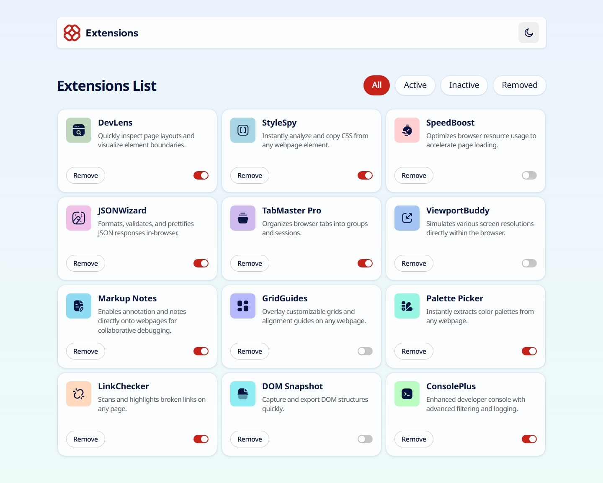
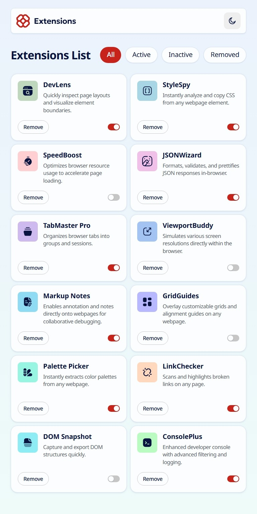
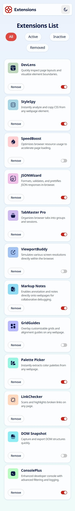

# Browser extension manager UI

## Table of contents

- [Overview](#overview)
  - [Screenshot and live site URL](#screenshot-and-live-site-url)
- [My process](#my-process)
  - [Built with](#built-with)
  - [What I learned](#what-i-learned)
- [Author](#author)
- [Attribution](#attribution)

## Overview

### Screenshot and live site URL

| Desktop                               | Tablet                              | Mobile                              |
| ------------------------------------- | ----------------------------------- | ----------------------------------- |
|  |  |  |

[Live Site URL](https://extentions-manager.netlify.app/)

## My process

### Built with

- HTML/CSS/JS

### What I learned

- In CSS variables, you can store **any string value** that represents a property value — even complex ones like `box-shadow`.  
  Example: define two different `box-shadow` values in separate variables for different themes (light/dark) and switch between them dynamically.
- Setting `appearance: none;` on an input element **does not** remove it from the accessibility tree or keyboard navigation. It will still receive focus via the keyboard.
- Hiding an element with `visibility: hidden;` or `display: none;` **does** remove it from keyboard navigation.
- so If you want the element hidden visually but still accessible, use `appearance: none;` or `opacity: 0;`.
- Create a switch toggle using HTML and CSS by styling a checkbox or radio input with custom visuals.
- If a child element is absolutely positioned with `top: 0; right: 0; bottom: 0; left: 0;`, it will expand to fill the **entire width and height** of its parent.
- Use `JSON.stringify()` to store complex data structures in `localStorage`.
- Use `JSON.parse()` to retrieve and convert them back into JavaScript objects.
- `Promise.all()` is used when you have multiple promises and want to execute code **only after all of them have resolved**.  
  If any promise rejects, `Promise.all()` immediately rejects with that error.

## Author

- Github - [@AminForouzan](https://github.com/AminForouzan)
- Frontend Mentor - [@AminForouzan](https://www.frontendmentor.io/profile/AminForouzan)

## Attribution

- [Browser extension manager UI challenge on Frontend Mentor](https://www.frontendmentor.io/challenges/browser-extension-manager-ui-yNZnOfsMAp).
